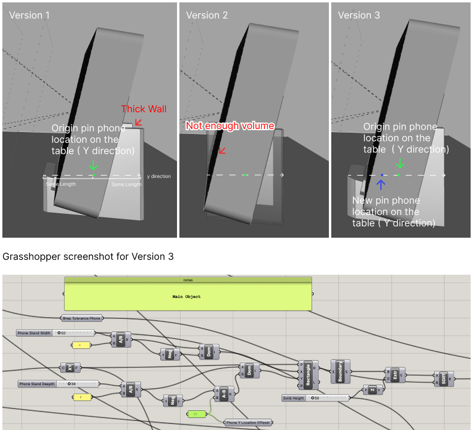
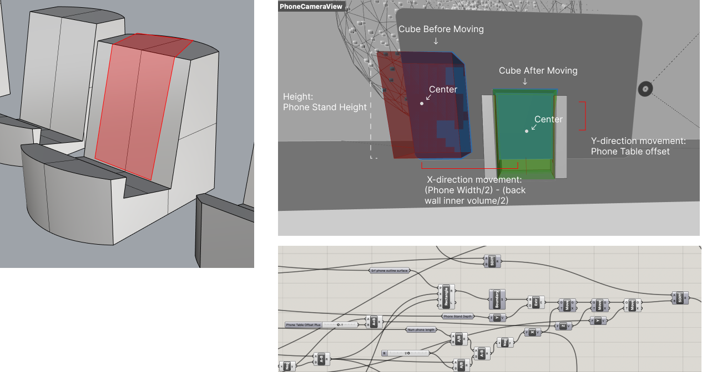
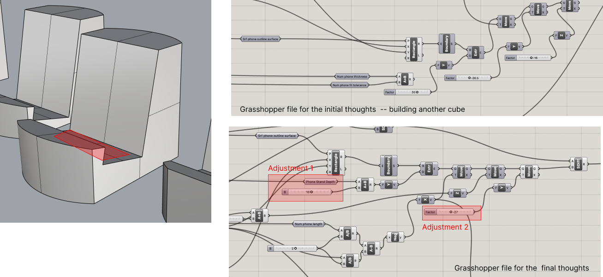
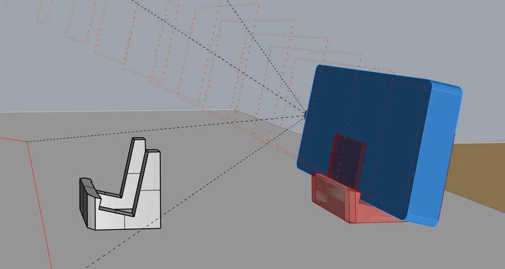

# Report 3 - Week of 09/14/2023 #

I found the Grasshopper demonstration led by TJ last Thursday and the instructional video to be extremely valuable resources for this project.
Exploring Grasshopper's Potential:

**1st Personalization**
My first design adjustment involved reducing the radius of the outer cone. This change was made to enhance the design's aesthetics and functionality.

**2nd Personalization: Replacing Cylinder with Cube: A More Complex Step:**

- The transition from a cylinder to a cube proved to be a more intricate task. It required the use of two domain sets to construct a rectangular shape, which was then converted into a boundary and extruded. One range set controlled the stand's width (X-direction), a relatively uncomplicated aspect. The other set, determining depth (Y-direction), presented a challenge.
- To optimize the design, I adjusted the Y-direction origin. Previously aligned with the 'pin phone location on the table,' this adjustment ensured equal spacing from both sides in the Y-direction. Given the need for sufficient depth on the front to securely hold the phone(Without enough depth, it will look like Version 2), I increased the depth value (Version 1). However, this change was balanced to prevent the creation of an excessively thick back wall. By moving the Y-origin forward by 5 units relative to the 'pin phone location on the table' in the Y-direction, I achieved the desired outcome—ample front depth while minimizing the rear volume (Version 3).
- 

**3rd Personalization: Creating the Back Wall Inner Volume:**

To create the back wall inner volume of the phone stand, I followed these steps:
First, I designed a rectangle based on the outline of the phone's surface. This rectangle had a height equal to the phone stand's desired height, with a slight addition to ensure it completely enclosed the phone.
The rectangle's width was calculated as the phone stand width minus the width we intended the two pillars to occupy.
I then converted this rectangle into a boundary and extruded it.
Initially, this resulting cube was aligned with the left-bottom corner of the phone's outline surface.
To align it precisely at the center of the phone stand, I performed two adjustments:
- In the X-direction, I moved the cube by (Phone Width/2) - (back wall inner volume/2).
- In the Z-direction, I moved it downward to match the phone table offset.

This process ensured that the back wall inner volume of the phone stand was correctly positioned and sized, providing the necessary space to support the phone securely while maintaining an aesthetically pleasing design.
- 

**4th Personation: Removing the Bottom Volume**

- To remove the undesired bottom volume of the phone stand, I initially considered creating another cube specifically for this purpose.
- However, upon further reflection, I realized that we could repurpose the cube created during the third step of the process.
- By adjusting the existing cube, I made it deeper and shifted it slightly forward to achieve the desired result. This approach not only simplified the design but also reduced unnecessary duplication of elements.
- - 

## Final Design
- - 
