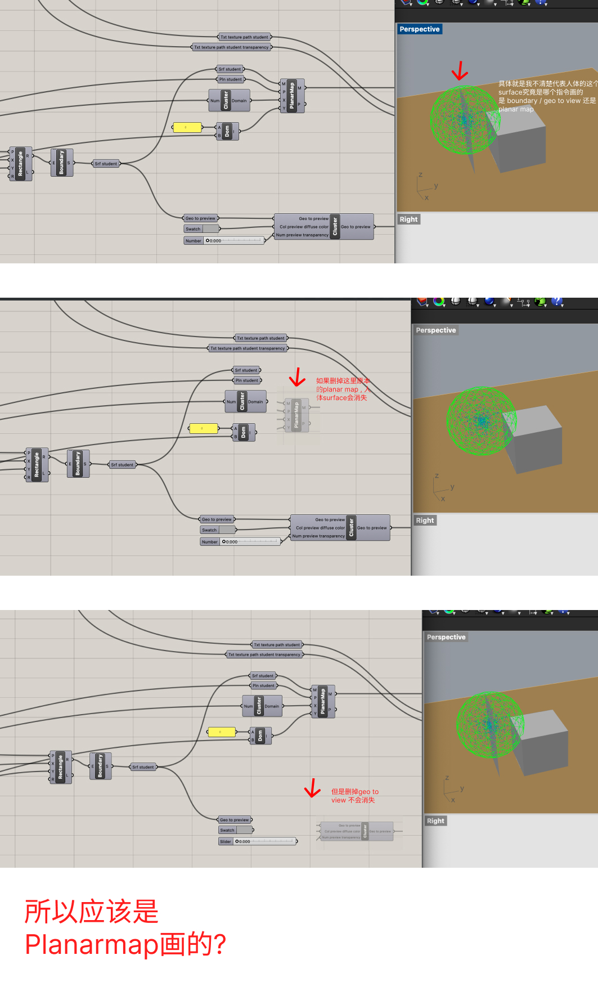
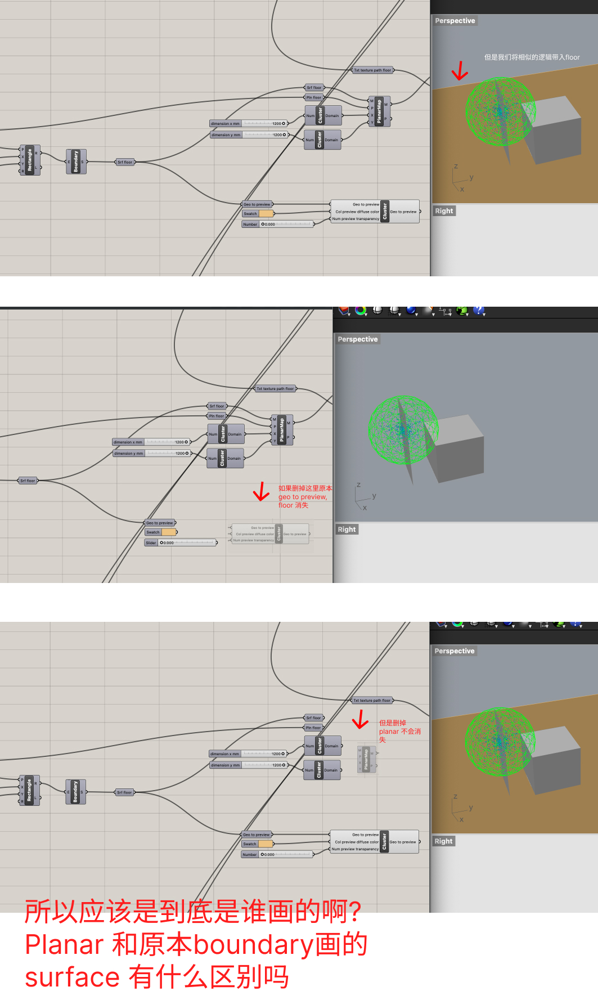
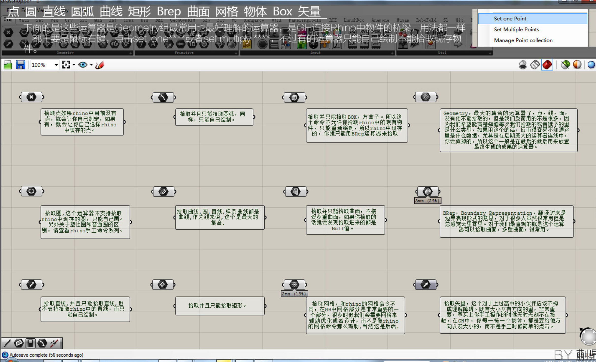

---
# Report 2 - Week of 09/01/2023 #
This week, I dive deeper to TJ's grasshopper file. 
Post our Thursday class, I delved into Rhino through Kyle's tutorial. Transitioning to Rhino proved challenging, particularly due to its unique set of hotkeys that significantly deviate from other design tools I've employed, like Figma. Remembering the correct keys for functions like panning, zooming, and rotating became a task. Moreover, setting up a Cplane with three points was an area I found particularly tricky. Seren, a fellow classmate, was instrumental in guiding me through this.

Picture of learning Rhinos via Kyle's video 

Picture of my cheat sheet of Rhino Hotkeys

Subsequently, I ventured into the realm of Grasshopper. My first interaction with Grasshopper was enlightening; it felt like genuine human-computer interaction. What struck me most was its data-driven approach, as opposed to relying solely on experiential assumptions. While TJ's file was incredibly constructed, it took some time to decipher.

Picture of manipulating Cell Phone Stand with Grasshooper

Grasshopper's tooltips facilitated my understanding. However, I faced a hiccup when it came to exporting AI files for laser cutting—a procedure I attempted prior to Tuesday's class where TJ provided further insights. Charon, another peer, was kind enough to introduce me to the 'bake' function.

Picture of design views after I baked it

Lastly, during our laser cutting phase, we discovered that our created models were undersized. Both Jenny and Adorey stepped in, showing me the ropes of exporting and laser cutting effectively.

Despite the challenges this week presented, the overwhelming support from our cohort made the journey smoother. I'm eagerly looking forward to diving deeper into Grasshopper next week.

Picture of laser cutting

